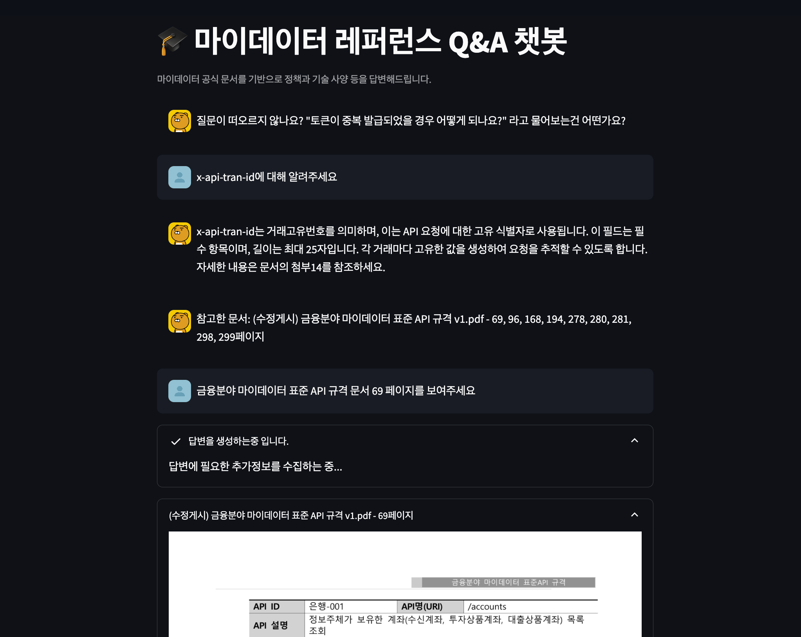
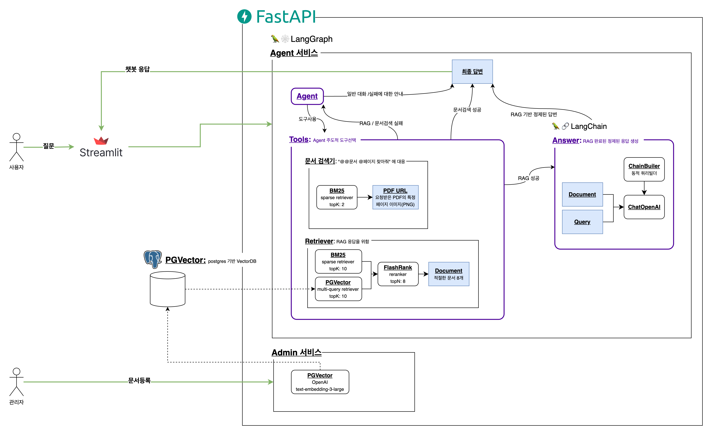
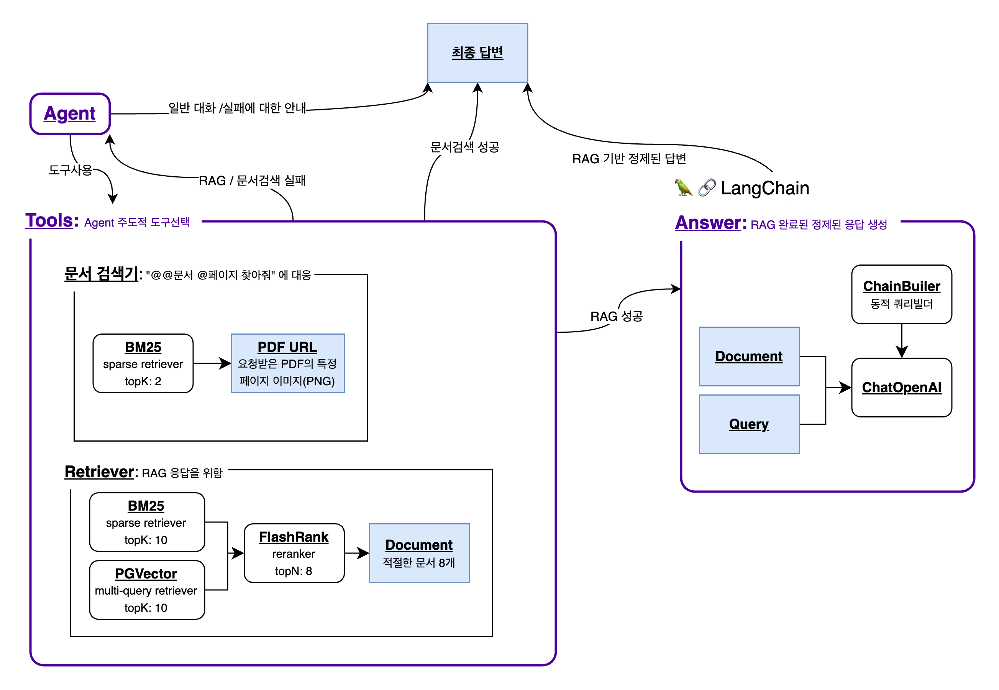
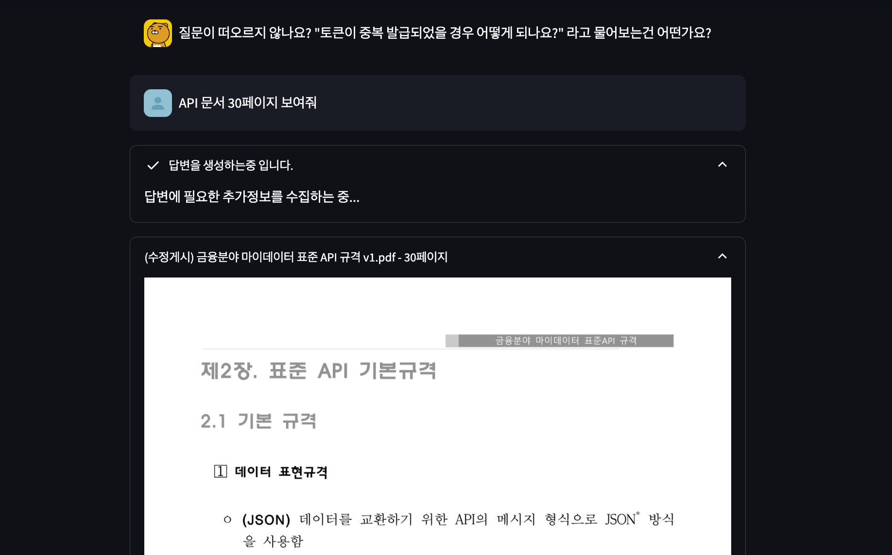
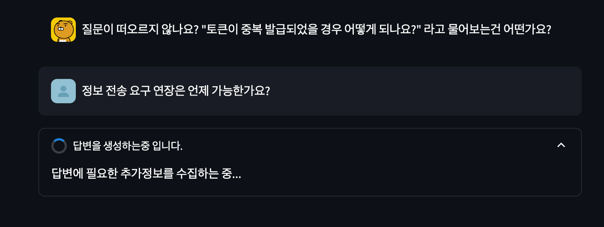
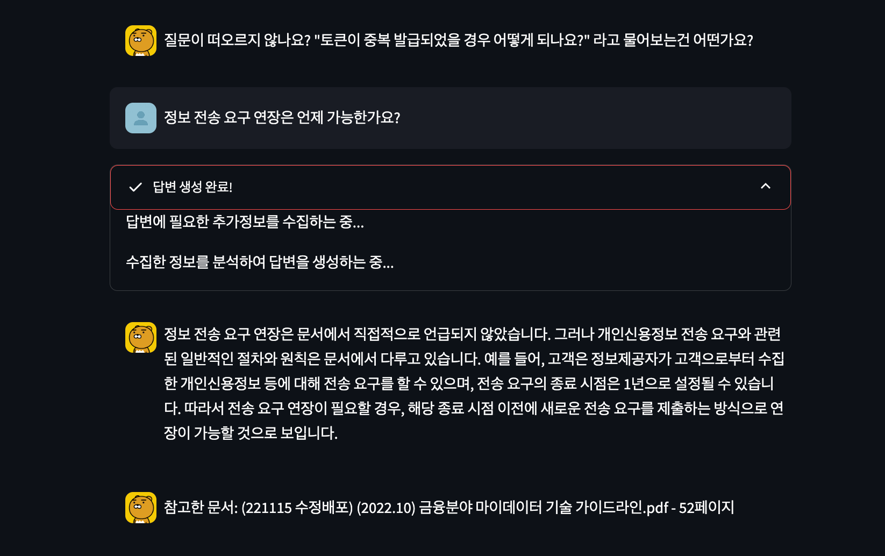

## 마이데이터 RAG-LLM Agent
`LangChain` `LangGraph` `OpenAI API`를 활용하여  마이데이터 공식 문서를 기반으로 정책과 기술 사양 등을 답변할 수 있는 챗봇 RAG-LLM 
Agent입니다.

---
## How to Run
- 🚨 프로젝트 실행시 `5432` `6379` `8000` `8506` 포트를 사용하므로, 해당 포트가 사용중이라면 사용중인 프로세스를 종료해주세요
- 🚨 반드시 OPENAI_API_KEY를 .env 에 설정하고난 다음 docker-compose를 실행해야 합니다!
### 1. .env 파일을 루트 디렉토리에 생성
```.dotenv
POSTGRES_HOST=pgvector
POSTGRES_PORT=5432

POSTGRES_DB=mydata-agent
POSTGRES_USER=mydata-agent-user
POSTGRES_PASSWORD=yhk-vqc_drq2GZK1rud

REDIS_HOST=redis
REDIS_PORT=6379
REDIS_DB=0

RETRIEVER_TOP_K=10
RETRIEVER_TOP_N=8

EMBEDDING_MODEL=text-embedding-3-large
CHAT_MODEL=gpt-4o

DOCUMENT_DIR=documents

OPENAI_API_KEY=<OPEN_API_KEY를 여기에 넣으세요>
```
### 2. Docker Compose를 통해 모두 실행
```bash
docker-compose up -d
```

---
## 서비스 페이지 [127.0.0.1:8506 으로 접속]

- 사용자가 질문을 입력하면 문서를 참고하여 답변을 생성하고, 참고한 문서 정보를 제공합니다.
- 사용자가 문서 페이지를 요청하면 해당 페이지를 이미지로 제공합니다.

---
## 아키텍처

### 관리자 Usecase
1. 관리자는 PDF 파일을 업로드합니다.
2. `RecursiveCharacterTextSplitter`를 통해 PDF를 Chunk로 나눕니다.
   - 이후 동일한 파일에 대한 요청이 들어올 경우를 위해 Pickle 로컬 캐시를 생성합니다.
   - 만약 동일한 파일에 대한 요청이 들어올 경우, 캐시된 Chunk를 사용합니다.
3. OpenAI `text-embedding-3-large` 모델을 활용하여 Chunk를 벡터화합니다.
4. 벡터화된 Chunk를 `PGVector`에 저장합니다.

---
### 사용자 Usecase
1. 사용자는 `Streamlit` 페이지를 통해 `마이데이터`에 대한 질문을 입력합니다. 가능한 질문 시나리오는 아래와 같습니다.
   - 마이데이터에 대한 질문
   - 문서 페이지 요청
   - History 기반, 이전 질문에 대한 추가 질문
2. `Agent`는 사용자 질문을 분석하여, Tool이 필요한지 즉시 응답 가능한지 판단합니다.
   - Tool이 필요한 경우: 대화 Context에 답변에 필요한 문서 정보가 없는 경우 / 특정 페이지 이미지를 요청하는 경우
   - 즉시 응답 가능한 경우: 대화 Context에 답변에 필요한 문서 정보가 있는 경우 / 이전 질문에 대한 추가 질문
3. `Tools`는 `Agent`가 결정한 Tool을 사용하여, 즉시 응답 가능한 경우에 대한 답변을 생성합니다.
   - 사용가능한 Tool은 `Retriever`, `문서검색기`가 있습니다.
     - `Retriever`: `PGVector`에 저장된 벡터와 사용자 질문 벡터를 비교하여, 가장 유사한 Chunk를 찾습니다.
     - `문서검색기`: 사용자가 요청한 문서의 특정 페이지 이미지를 제공합니다.
4. `Agent`는 직접 생성하거나, `Tools`로부터 받은 답변을 사용자에게 제공합니다.

---
## 프로젝트 폴더 구조
```text
├── api
│   ├── __init__.py
│   ├── main.py .................... 🚀 FastAPI 서버 진입점
│   ├── admin ...................... 📌 RAG에 사용할 파일을 업로드하는 서비스 
│   │   ├── __init__.py
│   │   ├── router.py
│   │   └── service.py
│   ├── agent ...................... 📌 RAG-LLM을 활용하여 답변을 생성하는 서비스
│   │   ├── __init__.py
│   │   ├── router.py
│   │   ├── schema.py
│   │   ├── service.py ............. ⭐️ LangGraph를 통해 Agent구성 및 답변 생성
│   │   └── tools.py ............... 🔧 AGENT가 사용할 Tool 함수들
│   ├── documents
│   │   ├── 예제파일1.pdf 
│   │   ├── 예제파일2.pdf 
│   │   ├── 테스트.pdf
│   │   ├── __init__.py
│   │   ├── page_chunk ............. 📁 "@@문서 @페이지 보여줘" 요청에 대한 PDF 이미지 저장소
│   │   ├── pickle ................. 🥒 여러번의 서버 실행에도, 캐싱된 FileChunk를 사용하기 위한 저장소
│   ├── prompt
│   │   ├── __init__.py
│   │   └── prompt.yml ............. 📝 LangChain 및 MultiQuery Retriever에 사용할 Prompt
│   ├── util ....................... 🛠 API 서비스에 사용할 유틸리티 함수
│   │   ├── __init__.py
│   │   ├── chain_builder.py ....... 📜 동적 Chain 구성을 위한 함수
│   │   ├── config.py .............. 📦 환경변수 (w/ Pydantic Settings)
│   │   ├── custom_wrapper ......... 🎁 API 서비스에 사용할 커스텀 래퍼 (Dict입력 대응 등)
│   │   ├── dependency.py .......... 📦 VectorStore, ChatOpenAI 등의 의존성 정의
│   │   ├── processor.py ........... 🧹 Chain 입력을 정규화하는 함수
│   │   ├── splitter.py ............ 🪓 RAG구성을 위해 PDF를 Chunk로 나누는 함수
│   │   └── utils.py ............... 🛠 Singletone 데코레이터 등 유틸리티 함수
│   └── test ....................... 🧪 API 테스트(noqa)
│       ├── __init__.py
│       ├── admin
│       ├── agent
│       └── util
├── client .......................... 🌐 Streamlit 클라이언트
│   ├── __init__.py
│   ├── app.py ...................... 🚀 Streamlit 서버 진입점
│   └── assets
│       ├── favicon.png
│       └── profile
├── docker .......................... 🐳 Docker 로컬 볼륨
│   └── pgvector
│       ├── data
│       └── init.sql
├── docker-compose.yml .............. 🐳 Docker Compose 설정
├── poetry.lock
└── pyproject.toml

```
---
## Key Features & Tools
### ⭐ Agent 주도형 챗봇
> 키워드: `LangGraph` `LangChain` `Tool Bind`

LangChain에서 정의하는 Agent는 아래와 같습니다.

> 에이전트의 핵심 아이디어는 언어 모델을 사용하여 취할 일련의 행동을 선택하는 것입니다. 체인에서 일련의 행동은 하드코딩됩니다(코드로). 에이전트에서 언어 모델은 어떤 
> 행동을 어떤 순서로 취할지 결정하는 추론 엔진으로 사용됩니다.

따라서 Agent 주도형 챗봇을 구현하기 위해, Agent가 사용할 수 있는 Tool을 정의하고, Agent가 Tool을 사용하여 답변을 생성하도록 구성했습니다.


위의 이미지에서 확인할 수 있듯, Agent는 [즉시 답변]하거나, [Tool을 사용]하는 선택을 합니다.
- Tool을 사용하는 경우, Agent는 사용할 Tool을 선택하고, Tool이 답변을 생성하도록 합니다.
- 즉시 답변하는 경우, Agent가 가지고있는 LLM 모델을 사용하여 답변을 생성합니다.

사용가능한 Tool은 `Retriever`, `문서검색기`가 있습니다.
- `Retriever`: `PGVector`에 저장된 벡터와 사용자 질문 벡터를 비교하여, 가장 유사한 Chunk를 찾습니다.
- `문서검색기`: 사용자가 요청한 문서의 특정 페이지 이미지를 제공합니다.

```python
self.tool_set = [
    StructuredTool.from_function(
        func=rag(self.retriever),
        name="mydata-retriever",
        description="금융분야 마이데이터 표준 API 규격과 금융분야 마이데이터 기술 가이드라인을 검색합니다. 'API 스펙 중 aNS는 어떤 것을 "
        "뜻하나요?'같은 질문에 이 도구를 사용하세요.",
        args_schema=RAGInput,
    ),
    ...
]
```
ToolBind는 복잡한 Chain구성을 요구하지 않고, 아래와 같이 간단한 함수로 구성할 수 있도록 설계했습니다. Agent는 description을 참고하여, 가장 
적절한 Tool을 선택하여 동작합니다.

---
### ⭐ 문서 페이지 이미지 제공
> 키워드: `문서 이미지 제공`


앞서 언급한 Tool 중 하나로, `문서검색기`를 언급했습니다. 이 Tool을 통해, "API문서 30페이지 보여줘"와 같은 요청에 대해, 해당 페이지의 이미지를 제공할 
수 있도록 구현했습니다.
- 이미지를 Base64 그대로 응답하는것은 Context를 크게 차지하게 되므로, 이미지를 저장하고, 해당 이미지의 URL을 응답하는 방식으로 구현했습니다.

---
### ⭐ 답변생성 진행상황 제공
> 키워드: `진행상황 제공` `UX 개선`
 
챗봇 서비스는 LLM 추론서버 혹은 API 서버의 상태에 따라 응답이 늦어질 수 있습니다. 그 외에도, 여러 Tool을 사용하여 답변을 생성하는 경우에도 답변이 늦어질 수 
있습니다. 이런 상황에 사용자에게 답변이 생성중임을 알려주는 기능을 구현했습니다.


답변 생성이 시작되면 위와 같이, 사용자에게 답변 생성중임을 알려주는 메시지를 제공합니다.


Tool 사용 등, 답변 생성 프로세스가 진행됨에 따라 위와같이 단계에 대한 정보를 제공합니다.

---
### ⭐ 정확한 답변 생성을 위한 Retriever 구조
> 키워드: `PGVector` `BM25` `Reranker` `MultiQuery`
 
Retriever는 질문에 따라, 어떤 문서가 가장 적절한 문서인지 판단하여 답변을 가져오게 됩니다. 하지만 질문의 종류에 따라, `Lexical Similarity`가 
높은 문서가 적절할 수도 있고, `Semantic Similarity`가 높은 문서가 적절할 수도 있습니다. 이를 위해, `BM25`와 `Reranker`를 
`EnsembleRetriever`로 결합한 뒤, `FlashRank Reranker`를 통해 최종적으로 가장 적절한 문서를 선택하도록 구현했습니다.

---
### 멀티턴 에이전트
> 키워드: `AsyncRedisSaver` `checkpointer`

멀티턴 에이전트는 사용자가 이전 질문에 대한 추가 질문을 하는 경우, 이전 질문에 대한 답변을 참조하여 답변을 생성합니다. 이를 위해, `AsyncRedisSaver`를 
적용하여 이전 질문에 대한 답변을 저장하고, `checkpointer`를 통해 이전 질문에 대한 답변을 참조할 수 있도록 구현했습니다.

---
### 확장 가능한 프로젝트 구조
> 키워드: `동적 Chain Builder` `Pydantic Schema` `Dependency Injection`

LLM 챗봇 서비스는 많은 사용자를 대상으로 하기에, 요청시마다 어떤 서비스 객체를 생성하는것은 비효율적입니다. 이를 위해, `Dependency Injection`을 
통해, Singleton으로 생성된 객체를 사용하도록 구현했습니다.
```python
# 싱글톤 객체
@singleton
class RetrieverFactory:
    """PGVector, LLM, BM25Retriever를 사용하여 ContextualCompressionRetriever 객체를 생성하는 클래스"""

    def __init__(self, config: AppConfig = get_app_config()):
        self.config = config

# 의존성 주입 예시
class AgentService:
    def __init__(
        self,
        config: AppConfig = Depends(get_app_config),
        llm: ChatOpenAI = Depends(LLM()),
        retriever: ContextualCompressionRetriever = Depends(RetrieverFactory()),
    ):
        ...
```

LLM 서비스를 개발하며 Chain을 반복하여 작성해야 하는 경우가 있습니다. 이런 경우에도, 보다 적은 코드량으로 Chain을 구성할 수 있도록, 동적 Chain 
Builder를 구현했습니다. 일례로, Output Parser를 문자열 파라미터로 선택할 수 있는 기능또한 구현했는데, 아래와 같이 간결한 사용법이 가능합니다.

```python
# 구현
class ChainBuilder:
    ...
    def _output_parser(output_parser: str):
        """output_parser_type에 따라, 해당하는 OutputParser를 반환합니다."""
        match output_parser:
            case "str":
                return StrOutputParser()
            case "json":
                return JsonOutputParser()
            case "agent":
                return OpenAIToolsAgentOutputParser()
            case _:
                raise ValueError(
                    f"지원하지 않는 output_parser_type입니다. ({output_parser})"
                )


# 사용 예시
chain_builder.build_chain(
    ...,
    llm=self.llm,
    output_parser="agent",
)
``` 

---
### 사용자별 요청에 대한 동시성 해결
> 키워드: `Session ID`

챗봇 서비스는 여러 사용자가 동시에 요청을 보낼 수 있습니다. 이런 경우, 사용자별로 요청을 구분하여, 사용자별로 요청에 대한 응답을 생성할 수 있도록 구현했습니다. 이를 
위해, 첫 요청에서 사용자마다 고유한 `Session ID`를 생성하고, 이후 요청에서는 이 `Session ID`를 사용하여 사용자를 구분하도록 구현했습니다.

```python
    async def generate_answer(self, *, question: UserQuerySchema):
        """사용자 질문에 대한 답변을 생성합니다.

        1. Agent LangGraph를 생성합니다.
        2. 세션 ID가 없는 경우 새로운 세션을 생성하여 사용합니다.
        3. Agent LangGraph를 실행하고, 결과를 반환합니다.
        """
        ...
        # 세션 ID 생성
        new_session_id = str(uuid4().hex)
        ...
        # session ID로 History를 가져오도록 설정
        async for event in agent_graph.astream(
            {"messages": ("user", question.query)},
            {
                "configurable": {
                    "thread_id": (question.session_id or new_session_id)
                }
            },
        ):
            ...
            # 응답 데이터에 세션 ID 추가
            yield f"data: {json.dumps(session_field | type_field | content)}\n\n"
``` 

---
### 모델 토큰 제한 해결
> 키워드: `history` `AsyncRedisSaver`

모델은 토큰 제한에는 크게 두가지 종류가 있습니다.
- `Max Tokens`: 한번에 처리할 수 있는 최대 토큰 수
- `TPM`: 분당 처리할 수 있는 토큰 수

`TPM`는 분당 처리할 수 있는 토큰 수를 의미합니다. 이 서비스에서는 `Completion` 또는 `MultiQuery`에서 OpenAI API를 사용하고 있습니다. 
그 중, `AsyncRedisSaver`를 사용하여, 기존에 Retrieve한 문서를 Context에 들고 있다면, `MultiQuery`요청을 보내지 않도록 하여 
`TPM`을 초과하지 않도록 구현했습니다.


`MAX Tokens`는 한번에 너무 많은 History를 포함하거나 긴 문장을 처리할 때 발생할 수 있습니다. 이를 해결하기 위해, `tiktoken`을 사용하는 
`_filter_message_by_token_length` 함수를 사용하여, 요청을 보내기 전 최대 토큰 이내로 History를 필터링하도록 구현했습니다.
```python
async def _filter_message_by_token_length(messages):
    # 메시지를 최근것부터 순회하면서, 토큰 길이 총 합이 1000을 넘지 않도록 합니다.
    filtered_messages = []
    token_length = 0
    for message in reversed(messages):
        token_length += await _get_token_length(message.content)
        if token_length > 3072:
            break
        filtered_messages.append(message)

    return list(reversed(filtered_messages))
```


